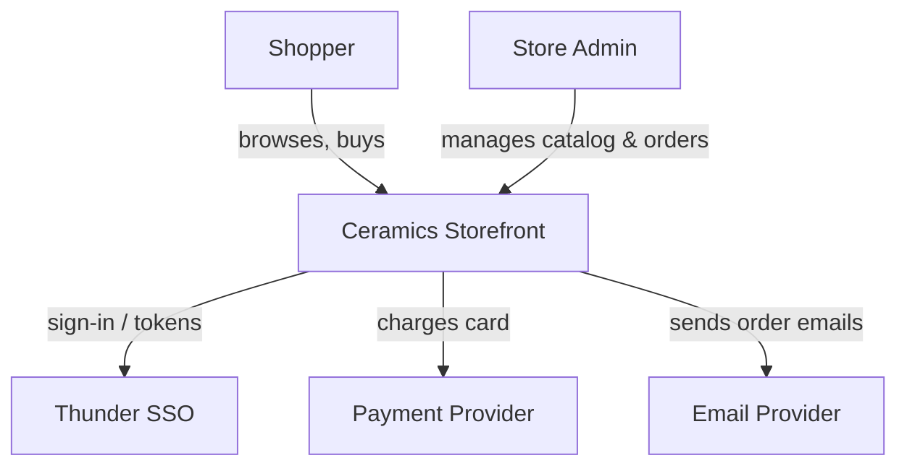
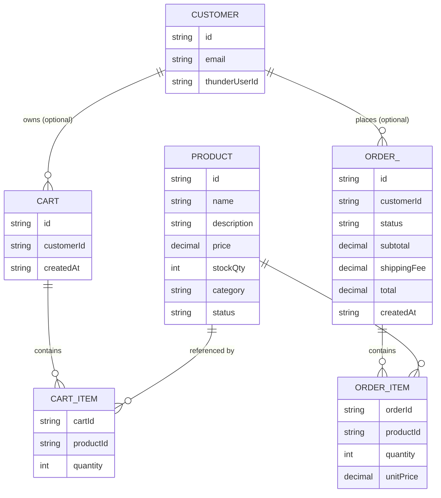
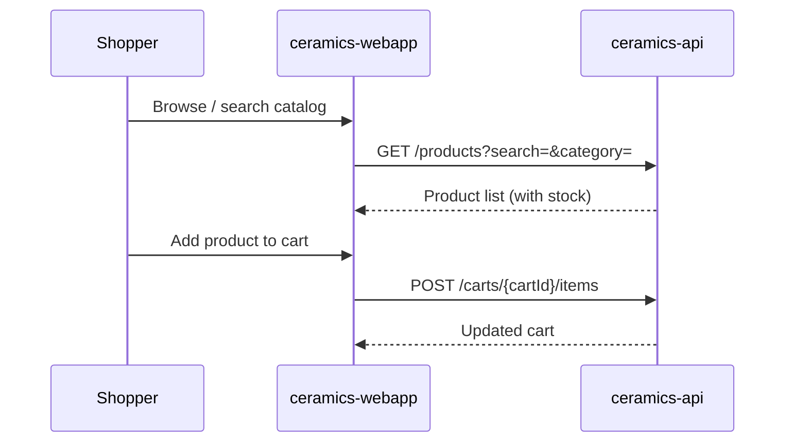
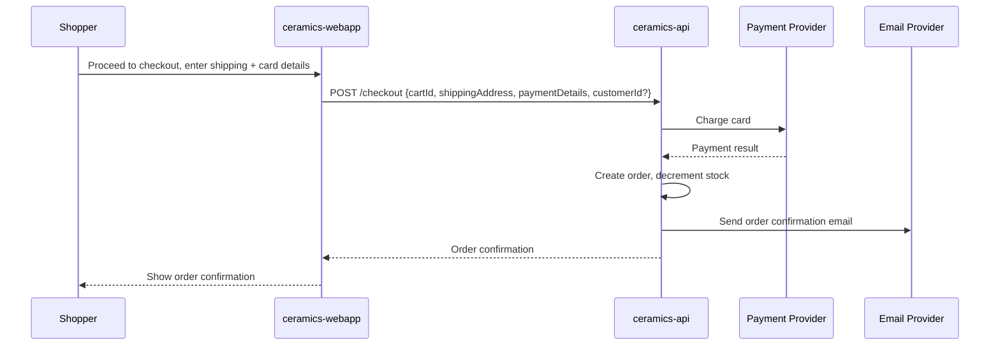
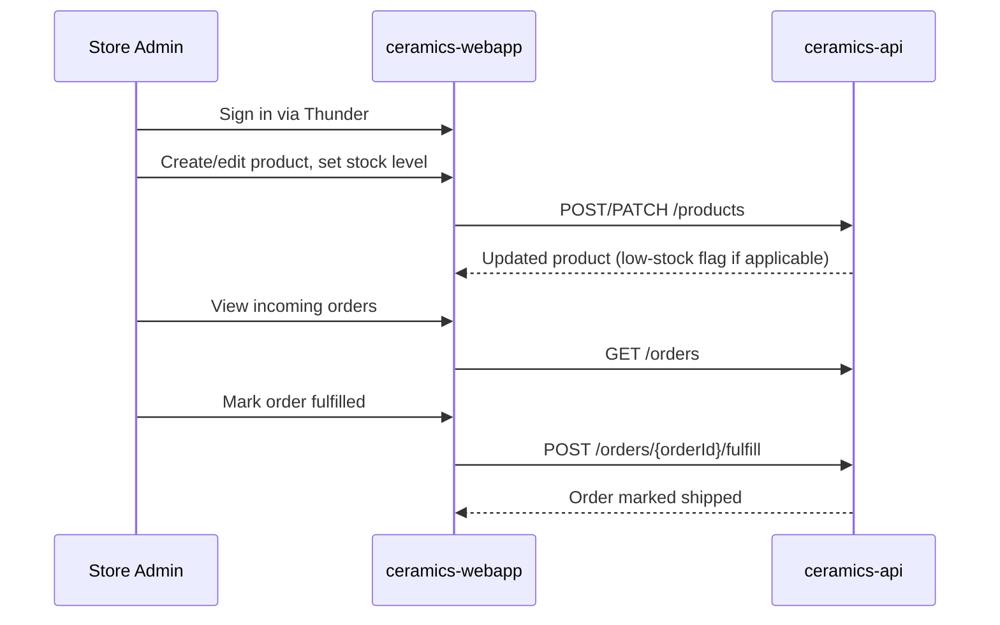

# Ceramics Storefront — Design

## Overview

A single-seller online store for handmade ceramics. Shoppers browse a public catalog, manage a cart, and check out as a guest or signed in, paying by card with flat-rate shipping. The Store Admin, signed in via Thunder SSO, manages the catalog (including stock levels) and fulfills incoming orders. One `web-application` (`ceramics-webapp`) serves both roles with role-scoped screens; one `service` (`ceramics-api`) holds all business logic and data, backed by a database, Thunder for identity, and external payment and email providers.

## Context (C1)

## Domain model (ER)

## Key flows

### Browse and add to cart

### Checkout (guest or signed in)

### Admin manages catalog and fulfills orders

